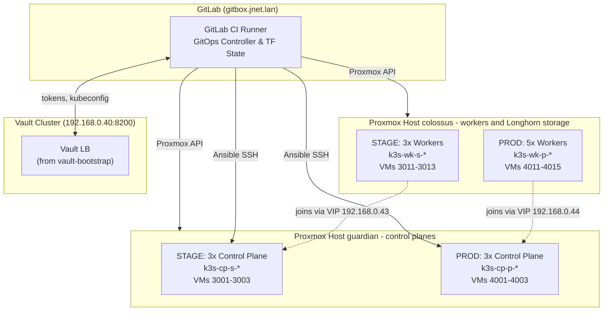

# K3s Multi-Environment Infrastructure Bootstrap (`infra-k3s-bootstrap`)

This repo has everything needed to stand up two independent, highly available K3s Kubernetes clusters - **STAGE** and **PROD** - as code, across two standalone Proxmox VE hosts. It covers the infrastructure (Terraform), the configuration (Ansible), and the GitOps CI/CD pipeline (`.gitlab-ci.yml`) that ties it all together. Both clusters are laid out the same way: control planes on **`guardian`**, workers and all Longhorn storage on **`colossus`**. Every secret it touches - Proxmox tokens, SSH deploy keys, the K3s bootstrap token, the generated `kubeconfig` - comes from the HashiCorp Vault cluster built in the sibling `vault-bootstrap` repo; nothing sensitive lives in Git.

> **This is a homelab playground, not production.** STAGE and PROD are both test environments. The names exist to exercise a real promotion workflow - STAGE first, then a tagged release to PROD - not because PROD serves anything that matters. The host layout reflects that: it's chosen for the hardware I have, not for resilience. In a real production environment, resources would be distributed - control planes spread across at least three hosts, workers and storage spread across hosts too, and PROD on hardware it doesn't share with STAGE. See [Host Layout & Failure Domains](#host-layout--failure-domains) for what this layout does and doesn't survive.

---

## System Architecture



---

## Host Layout & Failure Domains

Both clusters are split across the two hosts by role rather than by environment: every control plane node (STAGE's 3 and PROD's 3) runs on `guardian`, and every worker - and with them all Longhorn storage - runs on `colossus`. That's purely a hardware decision. `colossus` is the stronger of the two, with faster CPU and memory, so it gets the nodes that actually run workloads and serve storage, while `guardian` carries the comparatively light control plane VMs. It's the right trade for a playground and the wrong one for anything real.

Inside each cluster, 3-node embedded etcd quorum ($\lfloor 3/2 \rfloor + 1 = 2$) and kube-vip leader election protect against losing an individual *node*. They don't protect against losing a *host*, and with this layout a host failure reaches both environments at once:

* **`guardian` goes down**: all 3 control plane nodes of *both* clusters go with it, so there's no quorum left to preserve in either one. Workloads already running on the workers keep running, but nothing can be scheduled, healed, or changed until the control planes come back.
* **`colossus` goes down**: every worker in both clusters goes, and so does every Longhorn replica - all 3 replicas of every volume sit on the same physical machine. Longhorn's replication protects against losing a worker VM, not against losing `colossus` itself.

A real production layout would spread each cluster's control planes one-per-host across at least three hosts, spread workers and their Longhorn replicas across hosts too, and give PROD hardware it doesn't share with STAGE. A third Proxmox host is on the roadmap below for exactly that.

### Failure Scenarios & Mitigations

| Failure Scenario | Active Nodes | Cluster State | Impact | Operational Action |
|---|---|---|---|---|
| **Single Control Plane Node Lost** | 2/3 CP | **QUORUM MAINTAINED** | No downtime - kube-vip re-assigns the VIP to a surviving control plane node within seconds. | Run the `recover-node` pipeline (or `scripts/redeploy_node.sh`) against the dead node. |
| **Single Worker Node Lost** | 2/3 (stage) or 4/5 (prod) | N/A | Kubernetes reschedules evicted pods onto the remaining workers. | Same `recover-node` flow. |
| **Two Control Plane Nodes Lost** | 1/3 CP | **QUORUM LOST** | The API server stops accepting writes to avoid split-brain. | Not automated - this needs a manual etcd recovery, unlike the single-node case. |
| **`guardian` Fails** | 0/3 CP in both clusters | **QUORUM LOST (both clusters)** | Both API servers go down together. Running pods keep serving, but nothing can be scheduled, healed, or changed in either environment. | Restore the host, then re-run the pipeline to reconcile any missing VMs. Not solved until control planes are spread across hosts (see Roadmap). |
| **`colossus` Fails** | 0/3 (stage) and 0/5 (prod) workers | Control planes up, no workloads | Every workload and every Longhorn volume in both clusters is unavailable - all replicas live on this host. | Restore the host; Longhorn data comes back with its disks. Anything that has to survive losing `colossus` needs a backup off-host. |

---

## Architectural Rationale & Engineering Decisions

Here's the reasoning behind the bigger design decisions in this repo, and why they were made this way.

### 1. Control Planes on `guardian`, Workers on `colossus` - A Playground Trade-Off
* **The Challenge**: Only two physical Proxmox hosts are available, and they aren't equal - `colossus` has faster CPU and memory than `guardian`. Originally each environment got a whole host (STAGE on `guardian`, PROD on `colossus`), which kept the environments apart but left STAGE's workloads on the weaker machine.
* **The Solution**: Split by role instead of by environment. Both clusters' control planes run on `guardian`, and both clusters' workers - and all Longhorn storage - run on `colossus`, where the faster hardware does the actual work. The cost is that the environments now share failure domains (see [Host Layout & Failure Domains](#host-layout--failure-domains)). For a playground that's an easy trade; for real production it wouldn't be - there, the answer is a third host (on the roadmap) and a layout that spreads every role across hosts.

### 2. DHCP-First Networking, Not Static Management IPs
* **The Challenge**: Nodes get destroyed and recreated routinely - by `terraform apply -replace` during a single-node recovery, or by a full repave during a template upgrade. Hand-maintaining a static IP map for VMs that churn like that would be the first thing to drift out of date.
* **The Solution**: The management NIC (`net0`) just takes whatever DHCP hands it. `scripts/discover_node_ips.py` finds each node's live address via a parallel TCP probe, SSH validation, and the Proxmox QEMU guest agent API on both hosts, then rewrites `ansible_host` in the environment's inventory before every Ansible run. Only the internal cluster NIC (`net1`, VLAN 20/30) gets a static IP - the traffic that actually needs to be predictable: etcd, kubelet, CNI.

### 3. Targeted Terraform Replace for Node Recovery
* **The Challenge**: Rebuilding one dead node out of 6–8 without disturbing the rest is where a naive `terraform apply` gets dangerous.
* **The Solution**: Terraform's `-replace` flag targets exactly one indexed resource (`module.k3s_nodes.proxmox_virtual_environment_vm.k3s_workers[2]`), so the apply only ever touches the one broken VM. GitLab CI wraps this in a `recover-node` pipeline action that takes a `NODE_NAME`: it drains the node, removes its stale etcd/K3s membership, re-clones it from the template, re-hardens it, and rejoins it - zero manual `terraform state` surgery, zero risk to the healthy nodes.

### 4. `host-gw` Flannel + IPVS Instead of the Defaults
* **The Challenge**: K3s's out-of-the-box CNI mode (VXLAN) and kube-proxy mode (iptables) are built to work across arbitrary L3 topologies - overhead this cluster doesn't need to pay for.
* **The Solution**: Every node in an environment sits on the same internal L2 VLAN - trunked between `guardian` and `colossus`, since each cluster spans both - so Flannel runs in `host-gw` mode (plain kernel routes, no UDP encapsulation, full 1500 MTU) and kube-proxy runs in IPVS mode ($O(1)$ hash table lookups instead of $O(N)$ iptables chains), with `ipvs-strict-arp` on so MetalLB-style Layer 2 load balancing works cleanly on top.

### 5. Independent Template Versions Between STAGE and PROD
* **The Challenge**: Promoting a new base image straight to PROD is how you find out the hard way that it broke something.
* **The Solution**: `template_version` is a per-environment Terraform variable. A new golden image gets bumped and repaved in STAGE first (`make repave ENV=stage`), while PROD keeps running its last-known-good version until the change is deliberately promoted with its own release tag. STAGE and PROD are never required to agree on what template they're running.

### 6. Everything Secret Lives in Vault, Nothing in Git
* **The Challenge**: Proxmox API tokens, SSH deploy keys, and the K3s bootstrap token all need to reach the CI runner and the VMs somehow.
* **The Solution**: None of it is committed. `VAULT_ADDR` and `VAULT_TOKEN` are the only CI variables that touch secrets directly - everything else (Proxmox tokens, SSH keypairs, the generated `kubeconfig`) is pulled from or pushed straight to Vault (`secret/data/k3s-stage/*`, `secret/data/k3s-prod/*`) at pipeline runtime.

### 7. One Person, Several Job Titles
* **The Challenge**: Done the way a company would staff it, this project is really an infrastructure architect, a systems/virtualization engineer, a network engineer, a security engineer for the Vault/PKI side, a Kubernetes platform engineer, and a CI/CD engineer, all fluent in HCL, YAML, Python, Jinja2, and shell along the way. I'm sure people who are genuinely expert across all of that exist somewhere - I just don't happen to be one of them yet. I come from the systems/storage side of the house and am still working my way into DevOps.
* **The Solution**: AI is what let one person cover that whole span - it wrote a large share of the actual pipeline YAML, Terraform, and Ansible, across domains I'm still learning at different depths. What I brought, and checked by hand every time, was the architecture: placing nodes by role and host strength instead of cross-host HA, DHCP-first networking, how node recovery should behave - and whether the result actually did what I intended once it was running. Kubernetes is where I want to end up, but I want to genuinely understand the layers underneath it, not just consume them from a managed service - and I'm going to keep working at getting as well-versed in all of it as I can.

---

## Repository Structure

```
.
├── .gitlab-ci.yml                      # Root coordinator (STAGE auto, PROD manual/tag)
├── .gitlab/ci/                         # Isolated stage.gitlab-ci.yml / prod.gitlab-ci.yml child pipelines
├── Makefile                            # Target-aware automation (e.g. make plan ENV=stage)
├── README.md
├── environments/
│   ├── stage/
│   │   ├── ansible/
│   │   │   ├── group_vars/             # Stage VIP, domain, Vault paths
│   │   │   │   ├── all.yaml
│   │   │   │   ├── k3s_control_plane.yaml
│   │   │   │   └── k3s_workers.yaml
│   │   │   └── hosts.yaml              # Stage inventory (rewritten by discover_node_ips)
│   │   └── terraform/
│   │       ├── backend.tf              # HTTP backend targeting k3s-stage
│   │       ├── main.tf                 # Calls terraform/modules/k3s_nodes
│   │       ├── outputs.tf
│   │       ├── variables.tf
│   │       └── terraform.tfvars        # Stage sizing, VM IDs, VIP, template_version, host placement
│   └── prod/
│       ├── ansible/
│       │   ├── group_vars/             # Prod VIP, domain, Vault paths
│       │   │   ├── all.yaml
│       │   │   ├── k3s_control_plane.yaml
│       │   │   └── k3s_workers.yaml
│       │   └── hosts.yaml              # Prod inventory (rewritten by discover_node_ips)
│       └── terraform/
│           ├── backend.tf              # HTTP backend targeting k3s-prod
│           ├── main.tf                 # Calls terraform/modules/k3s_nodes
│           ├── outputs.tf
│           ├── variables.tf
│           └── terraform.tfvars        # Prod sizing, VM IDs, VIP, template_version, host placement
├── ansible/
│   ├── ansible.cfg
│   ├── playbooks/                      # 100% reusable across stage and prod
│   │   ├── provision_k3s.yaml
│   │   ├── provision_os.yaml
│   │   ├── redeploy_node.yaml          # Single-node recovery
│   │   ├── reset_cluster.yaml
│   │   ├── rolling_update.yaml
│   │   ├── seed_vault.yaml
│   │   └── site.yaml                   # Master end-to-end playbook
│   ├── requirements.yaml
│   └── roles/
│       ├── k3s_common/                 # CIS sysctl, swap, kernel modules
│       ├── k3s_control_plane/          # Embedded etcd, kube-vip, TLS SANs
│       └── k3s_worker/                 # Longhorn disk mount, join
├── terraform/
│   └── modules/
│       └── k3s_nodes/                  # Shared VM provisioning module (Template 1001)
│           ├── main.tf
│           ├── outputs.tf
│           ├── variables.tf
│           └── versions.tf
├── scripts/                            # Parameterized with $ENV or CLI argument
│   ├── discover_node_ips.py            # DHCP -> live IP resolution (TCP probe + guest agent)
│   ├── discover_node_ips.sh
│   ├── get_kubeconfig.sh
│   ├── k3s_env.sh
│   ├── redeploy_node.sh                # CLI single-node recovery
│   ├── rolling_upgrade.sh              # In-place upgrade or full repave
│   ├── vault_seed.sh
│   └── vault_sync.sh
└── docs/
    ├── architecture.md
    ├── gitops-workflow.md
    ├── gitlab-setup.md
    ├── node-repaving.md
    ├── operations.md
    ├── rolling-updates.md
    └── vault-integration.md
```

---

## Deployment Guide (GitOps Pipeline)

### 1. Configure GitLab CI/CD Variables
For the full walkthrough (Proxmox role/token creation on both hosts, SSH deploy keys), see **[docs/gitlab-setup.md](docs/gitlab-setup.md)**. At minimum:

| Variable | Masked | Description |
|---|---|---|
| `VAULT_ADDR` | No | Vault load balancer endpoint (`https://192.168.0.40:8200`) |
| `VAULT_TOKEN` | **Yes** | Administrative or scoped bootstrap token used to seed/read secrets |
| `TF_VAR_pve_host_1_endpoint` / `_api_token` / `_node_name` | Token: **Yes** | Proxmox API credentials for `colossus` (workers, both environments) |
| `TF_VAR_pve_host_2_endpoint` / `_api_token` / `_node_name` | Token: **Yes** | Proxmox API credentials for `guardian` (control planes, both environments) |

### 2. Trigger the Pipeline
Push to `main` and STAGE runs automatically. PROD only runs when you promote it - via a release tag, a manual play button, or `TARGET_ENV=PROD` on a manual run. Each environment's child pipeline runs through:
1. **`seed`**: Idempotently seeds Vault with the environment's bootstrap token, credentials, and network parameters.
2. **`plan`**: Builds and inspects the Terraform execution plan against GitLab-managed remote state.
3. **`apply`**: Provisions the environment's VMs - control planes on `guardian`, workers on `colossus`.
4. **`configure`**: Runs Ansible CIS hardening and K3s deployment (control plane, then workers).
5. **`verify`**: Confirms all nodes report `Ready` (6/6 for STAGE, 8/8 for PROD).

### 3. CLI Quick Start
All Makefile targets accept `ENV=stage` (default) or `ENV=prod`:

```bash
make seed ENV=stage         # 1. Seed Vault credentials (SSH keys, tokens, endpoints)
make plan ENV=stage         # 2. Plan infrastructure via Terraform
make apply ENV=stage        # 3. Provision VMs on Proxmox VE
make configure ENV=stage    # 4. Configure OS hardening & deploy K3s cluster via Ansible
make kubeconfig ENV=stage   # 5. Fetch kubeconfig
make verify ENV=stage       #    ...and confirm cluster readiness

# Promotion & Day-2 Operations:
make promote TAG=v1.1.0          # Tag and promote validated STAGE code to PROD
make rolling-upgrade ENV=stage   # Sequential zero-downtime rolling update
make repave ENV=stage            # Full VM rolling rebuild from base template
```

---

## Operational Utilities

The `scripts/` directory has a few helpers for day-2 cluster maintenance:

* **[`scripts/k3s_env.sh`](scripts/k3s_env.sh)**: Sets up your local shell with `KUBECONFIG` for the target environment.
  ```bash
  source scripts/k3s_env.sh stage
  kubectl get nodes -o wide
  ```
* **[`scripts/discover_node_ips.py`](scripts/discover_node_ips.py)**: Resolves every node's current DHCP address and rewrites the environment's Ansible inventory - run this any time a node has been recreated.
* **[`scripts/redeploy_node.sh`](scripts/redeploy_node.sh)**: CLI single-node disaster recovery - drains, replaces, re-hardens, and rejoins one node without touching the rest of the cluster.
  ```bash
  bash scripts/redeploy_node.sh k3s-wk-p-g7h8 prod
  ```
* **[`scripts/rolling_upgrade.sh`](scripts/rolling_upgrade.sh)**: Runs a sequential rolling update (`--mode in-place`) or a full VM repave (`--mode repave`), workers first, then secondary control planes, then the primary control plane last.

---

## Roadmap

* **Third Proxmox Host, Real Cross-Host Quorum**: Expand from 2 hosts to 3 and re-lay each environment's 3 control plane nodes one-per-host, so etcd quorum actually survives a full host going down instead of just a single node - and spread workers and their Longhorn replicas across hosts too, so losing `colossus` stops taking every workload with it. This is the priority item - see [Host Layout & Failure Domains](#host-layout--failure-domains) above for why it matters.
* **Golden Image Pipeline**: Automate the build of the AlmaLinux 9 CIS Level 2 template (VM `1001`) itself, so all hosts stay in sync without a manual template rebuild - the same gap `vault-bootstrap` has open for its own template.
* **Monitoring Rollout**: Nodes are already labeled for it (`monitoring.jnet.lan/enabled`, `monitoring.jnet.lan/group`), but the Prometheus/VictoriaMetrics scrape stack that reads those labels isn't wired up yet.
* **Short-Lived Kubeconfig Credentials**: The `kubeconfig` stored in Vault today is a long-lived static admin credential; moving to OIDC or short-lived certificates would shrink the blast radius if that Vault path were ever compromised.
* **Dedicated Compute vs. Storage Worker Pools**: Every worker today is identical - one shared `worker_config` for cores/memory/disks, sized as a compute+storage generalist. At real scale that stops making sense: storage-heavy nodes (Longhorn) want different CPU/memory headroom than compute-heavy ones. Plan is a second node pool (its own count, VM ID range, and resource config, mirroring how control plane and worker pools already exist as separate resource blocks) rather than reworking the existing pool into a `for_each`, so it doesn't force a full repave of every current node just to add the distinction. See the CPU/Memory Drift note in [Architecture & Hardware Layout](docs/architecture.md#2-resource-allocation-matrix) for the related sizing-drift gap this would also help close.

---

## Documentation Index

* **[GitOps Workflow & Promotion Guide](docs/gitops-workflow.md)**: Child pipeline architecture, promoting STAGE to PROD, automated node recovery via pipeline, and release tag workflows.
* **[Architecture & Hardware Layout](docs/architecture.md)**: Dual-network topology, kube-vip HA, Flannel `host-gw`, IPVS proxy, dedicated etcd and Longhorn storage disks.
* **[GitLab CI/CD Setup Guide](docs/gitlab-setup.md)**: Proxmox role/token creation, CI/CD variables, and multi-environment pipeline flow.
* **[HashiCorp Vault Secrets Management](docs/vault-integration.md)**: Structure of `secret/data/k3s-stage/*` and `secret/data/k3s-prod/*`, automated seeding, and kubeconfig synchronization.
* **[Operations & Day-2 Runbook](docs/operations.md)**: Verification commands, SSH access via DHCP discovery, troubleshooting, cluster reset, and teardown.
* **[Rolling Upgrades & Maintenance](docs/rolling-updates.md)**: Sequential 3-phase rolling upgrade runbook (Workers -> Secondary Control Planes -> Primary Control Plane).
* **[Single-Node Repaving & DR](docs/node-repaving.md)**: Single-node destruction, recreation via Terraform, re-hardening via Ansible, and zero-downtime rejoin.
